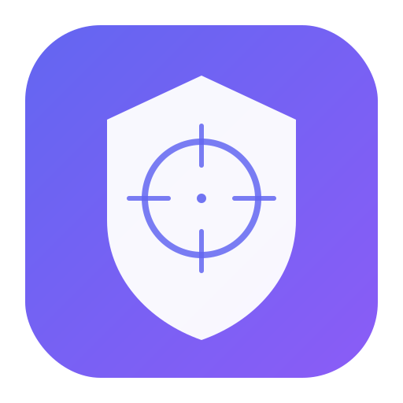

<p align="center">
  
</p>

<h1 align="center">ThreatCaddy</h1>

<p align="center">
  <strong>Local-first threat investigation workspace for security analysts.</strong><br/>
  Notes, IOCs, timelines, graphs, CaddyAI, and team collaboration — all in your browser.
</p>

<p align="center">
  <a href="https://github.com/peterhanily/threatcaddy/blob/main/LICENSE"></a>
  
  
  
  
  
  <a href="https://chromewebstore.google.com/detail/threatcaddy-%E2%80%94-quick-captu/lakelgngpkkaeinfdlnmifookbeeffbh"></a>
</p>

<p align="center">
  <a href="https://threatcaddy.com">threatcaddy.com</a> &nbsp;|&nbsp;
  <a href="https://threatcaddy.com/?demo=1">Live Demo</a> &nbsp;|&nbsp;
  <a href="https://chromewebstore.google.com/detail/threatcaddy-%E2%80%94-quick-captu/lakelgngpkkaeinfdlnmifookbeeffbh">Chrome Extension</a>
</p>

---

## Why ThreatCaddy?

Most investigation tools lock your data in a cloud you don't control, cost per seat, and force you into rigid workflows. ThreatCaddy is different:

- **Local-first** — All data lives in your browser's IndexedDB. No accounts, no tracking, no cookies.
- **Zero setup** — Open the URL and start working. No install, no server required.
- **Optional team server** — When you need collaboration, spin up a Docker container. Per-investigation sync lets you choose what stays local and what gets shared.
- **Encryption at rest** — AES-256-GCM encryption with PBKDF2 key derivation protects your data even on shared machines.
- **Works offline** — Download a standalone HTML file that runs from `file://`.

## Quick Start

**Try it now:** [threatcaddy.com/?demo=1](https://threatcaddy.com/?demo=1) loads a sample investigation with a guided walkthrough.

**Self-host the client:**

```bash
pnpm install
pnpm dev          # Dev server at localhost:5173
```

**Deploy a team server:**

```bash
cd server
cp .env.example .env   # Configure JWT keys and optional LLM API keys
docker compose up -d   # Starts Hono server + PostgreSQL
```

---

## Features

### Notes & Editor

- **Markdown editor** with live preview, split view, and syntax highlighting for 20+ languages
- **Wiki-links** — Type `[[note title]]` to link between notes with autocomplete and broken-link indicators
- **Slash commands** — `/` menu with formatting, threat intel templates (IOC tables, MITRE references, TLP headers), and quick inserts
- **Note annotations** — Timestamped comments on any note
- **Defang/Refang toggle** — Preview network IOCs in defanged form (`hxxps://`, `example[.]com`)
- **Open markdown files** — Open `.md` or `.txt` files as notes via `Ctrl+O` / `Cmd+O`, drag-and-drop, or the New menu. File name, size, and creation date are captured in the title. IOCs are auto-extracted on import
- **Quick capture** — Clip articles, bookmarks, code snippets, and meeting notes with 15+ built-in templates
- **Note templates** — 15 built-in templates (host details, malware analysis, phishing reports, threat actor profiles, and more). Create, edit, and save your own custom templates. Save any note as a reusable template.

### Investigation Playbooks

- **Built-in playbooks** — 6 pre-built playbooks: Incident Response, Phishing Investigation, Malware Analysis, Threat Hunt, Data Breach, and Vulnerability Assessment
- **Custom playbooks** — Create your own playbooks with ordered steps that auto-populate investigations with tasks and notes
- **One-click instantiation** — Start a new investigation from a playbook and get a complete workspace: folder, timeline, tasks with phases/priorities, and pre-filled notes from templates
- **Playbook management** — Create, edit, and delete custom playbooks in Settings; browse and use built-in playbooks from the sidebar

### Task Management

- Priorities, due dates, and statuses with list and kanban views
- Threaded comments on tasks

### CaddyAI

- **Multi-provider** — Anthropic (Claude Opus 4, Sonnet 4, Haiku 3.5), OpenAI (GPT-5.4, GPT-5.4 Pro, GPT-5.2, GPT-5 Mini, o3, o4-mini, GPT-4.1, GPT-4.1 Mini, GPT-4o), Google Gemini (2.5 Pro, 2.5 Flash), Mistral (Large, Small, Codestral), and local models (Ollama / LM Studio / vLLM)
- **Tool calling** — Agentic loop with 29 tools to search, read, list, create, and update all entities, extract IOCs, fetch URLs, generate reports, and cross-investigation analysis
- **Slash commands** — `/fetch`, `/search`, `/note`, `/task`, `/iocs`, `/summary`, `/timeline`, `/report`, `/triage`, `/graph`, `/link`
- **Persistent threads** with auto-generated titles

### Threat Intelligence & Analysis

- **IOC extraction** — Auto-extract IPv4, IPv6, domains, URLs, emails, hashes (MD5/SHA-1/SHA-256), CVEs, MITRE ATT&CK IDs, YARA rules, Sigma rules, and file paths
- **Standalone IOCs** — Manage IOCs with type, confidence, subtypes, analyst notes, attribution, and classification
- **IOC relationships** — Many-to-many links with typed, directional relationships (e.g. domain "resolves-to" IP, hash "exploits" CVE)
- **Entity graph** — Interactive force-directed graph of IOCs, notes, tasks, and timeline events with drag-to-link, filtering, and multiple layouts
- **IOC dashboard** — Aggregate stats: type/confidence distribution, top actors, timeline, frequency tables
- **TLP/PAP classification** — Traffic Light Protocol and Permissible Actions Protocol levels on entities and investigations
- **Export** — JSON, CSV (grouped or flat), STIX 2.1 bundles; push to OCI object storage

### Timeline & Whiteboard

- **Incident timeline** — Map events to MITRE ATT&CK tactics with timestamps, confidence, and linked IOCs
- **Multi-timeline support** — Per-investigation timelines with dedicated views
- **Timeline map** — Geolocated events on an interactive Leaflet map with clustered markers
- **Smart data import** — Paste CSV, TSV, JSON, or NDJSON from SIEMs and EDR tools; auto-detect format, auto-map columns (Splunk, CrowdStrike, Elastic)
- **Whiteboards** — Freeform drawing with Excalidraw integration
- **Activity log** — Track all actions across notes, tasks, timeline, and IOCs

### Organization

- **Investigations** — Color-coded folders with active/closed/archived lifecycle, closure resolutions, scoped entity counts, and bulk operations
- **Per-investigation sync** — Toggle cloud sync per investigation; mark sensitive cases as local-only
- **Entity cross-linking** — Link notes, tasks, and timeline events to each other
- **Tags** — Color-coded tags with rename and delete
- **Full-text search** — Instant search across all entity types with saved searches and investigation-scoped filtering
- **Unified trash & archive** — Manage deleted and archived items in one view with 30-day auto-delete

### Security & Backup

- **Encryption at rest** — Passphrase-based AES-256-GCM via PBKDF2 (600k iterations) with configurable session duration and recovery phrase
- **Cloud backup** — OCI Object Storage, AWS S3, Azure Blob Storage, or Google Cloud Storage via pre-authenticated URLs
- **Export & import** — Full JSON backup/restore; per-investigation export; includes note templates and playbooks

### Team Server

- **Docker deployment** — `docker compose up` for Hono + Node.js server and PostgreSQL
- **Authentication** — Ed25519 JWT auth with user roles (admin, analyst, viewer)
- **Real-time sync** — Push/pull synchronization with version tracking, conflict detection, and WebSocket live updates
- **Presence** — See who's online and what they're viewing
- **Team feed** — Posts, reactions, threaded replies, mentions, and notifications
- **Investigation sharing** — Invite members with per-investigation roles (owner, editor, viewer)
- **Audit trail** — Server-side activity logging
- **Server-side LLM** — Proxy LLM requests through the server with shared API keys
- **File storage** — Upload and share files within investigations

### Platform

- **Quick Links dashboard** — Configurable shortcut tiles for VirusTotal, Shodan, AbuseIPDB, and other threat intel tools
- **Dark & light mode** — Dark by default
- **Guided tour** — Interactive onboarding walkthrough
- **Browser navigation** — Back/forward with persistent state across refresh
- **Standalone HTML** — Single-file offline version
- **Browser extension** — [Chrome Web Store](https://chromewebstore.google.com/detail/threatcaddy-%E2%80%94-quick-captu/lakelgngpkkaeinfdlnmifookbeeffbh) + Firefox extension to clip web content into ThreatCaddy
- **Keyboard shortcuts** — `Ctrl+N` (new note), `Ctrl+O` (open file), `Ctrl+K` (search), `Ctrl+S` (backup), `Ctrl+Shift+T` (new task), `Ctrl+E` (toggle editor mode), `` Ctrl+` `` (toggle preview), `Ctrl+1-4` (switch view), `Ctrl+/` (show shortcuts), `Ctrl+B/I` (bold/italic)

---

## Tech Stack

### Client

| Library | Purpose |
|---------|---------|
| React 19 + TypeScript 5 | UI framework |
| Vite 7 | Build tooling |
| Tailwind CSS 4 | Styling |
| Dexie.js | IndexedDB persistence |
| Cytoscape.js | Entity graph visualization |
| Excalidraw | Whiteboards |
| Leaflet + react-leaflet | Timeline map |
| Papa Parse | CSV/TSV parsing |
| marked + highlight.js + DOMPurify | Markdown rendering |
| lucide-react | Icons |

### Server

| Library | Purpose |
|---------|---------|
| Hono | HTTP + WebSocket framework |
| drizzle-orm + PostgreSQL | Database |
| argon2 | Password hashing |
| jose | JWT signing/verification |
| Docker + Docker Compose | Deployment |

---

## Development

```bash
pnpm install
pnpm dev              # Dev server at localhost:5173
pnpm test:run         # Run test suite
pnpm test:coverage    # Tests with coverage report
pnpm lint             # ESLint
pnpm tsc -b           # Type check
```

## Build

```bash
pnpm build            # Production build -> dist/
pnpm build:single     # Standalone HTML -> dist-single/index.html
```

## Browser Extension

Install from the [Chrome Web Store](https://chromewebstore.google.com/detail/threatcaddy-%E2%80%94-quick-captu/lakelgngpkkaeinfdlnmifookbeeffbh) or see [extension/README.md](extension/README.md) for Firefox and manual install instructions.

## Deploy

### Client (GitHub Pages)

Push to `main` and deploy via GitHub Pages pointing at `dist/` or a GitHub Actions workflow. Configured for `threatcaddy.com`.

### Team Server (Docker)

```bash
cd server
cp .env.example .env   # Set JWT_PRIVATE_KEY, JWT_PUBLIC_KEY (Ed25519)
docker compose up -d   # Starts Hono server + PostgreSQL
```

Optionally add `ANTHROPIC_API_KEY`, `OPENAI_API_KEY`, `GEMINI_API_KEY`, or `MISTRAL_API_KEY` to `.env` for server-side LLM proxying.

## Privacy

All data stays local by default. No accounts, no tracking, no cookies. API keys are stored in your browser and sent only to your chosen LLM provider. See the full [Privacy Policy](https://threatcaddy.com/privacy.html).

## License

MIT
