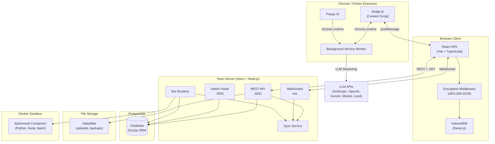
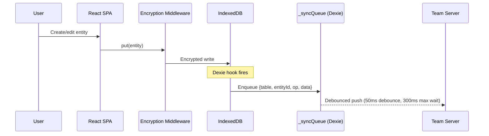
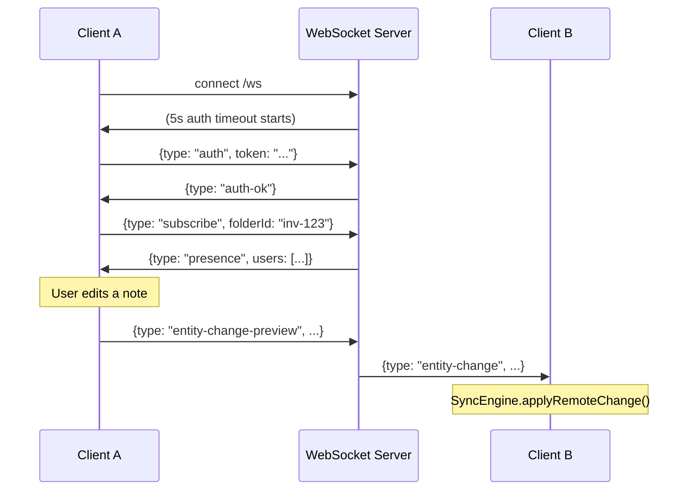
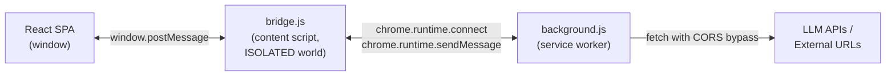
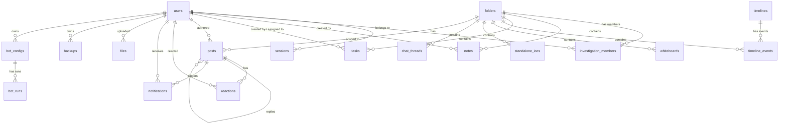
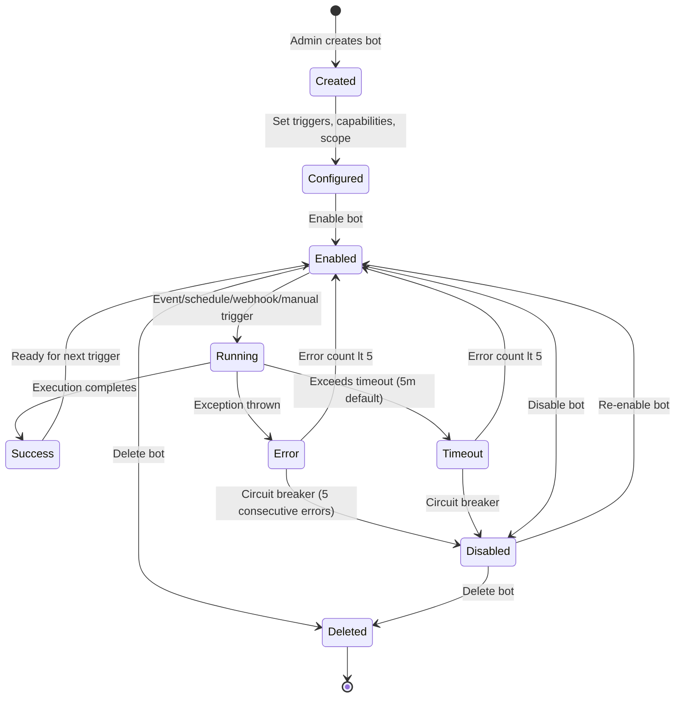

# ThreatCaddy Architecture

## 1. System Overview

ThreatCaddy is a local-first, team-capable threat intelligence workbench. Users can run it entirely offline in a browser, or connect to a shared team server for real-time collaboration.



### Component Roles

| Component | Technology | Purpose |
|-----------|-----------|---------|
| **Browser Client** | React, Vite, TypeScript, Dexie.js | Investigation workspace -- notes, tasks, timelines, IOCs, whiteboards, chat |
| **IndexedDB** | Dexie.js (18 schema versions) | Local-first storage. All data persists in the browser first. |
| **Encryption Middleware** | Web Crypto API (AES-256-GCM) | Transparent field-level encryption at rest in IndexedDB |
| **Extension** | Chrome MV3 / Firefox WebExtension | Web clipping, LLM API proxy (bypasses CORS), URL fetching |
| **Team Server** | Hono framework, Node.js 22 | REST API, WebSocket server, bot runtime, admin panel |
| **PostgreSQL** | v17 (Alpine) via Drizzle ORM | Shared data store for team mode |
| **Admin Panel** | Separate Hono app on port 3002 | Server-rendered HTML admin UI (users, bots, settings, audit) |
| **Bot Runtime** | In-process (BotManager) | Automated workflows triggered by events, schedules, webhooks |
| **Docker Sandbox** | dockerode | Isolated code execution for bots (Python, Node.js, Bash) |

---

## 2. Data Flow

### 2.1 Local-First Architecture

Every entity (note, task, timeline event, IOC, whiteboard, chat thread) is written to IndexedDB first. The server is optional -- the app is fully functional without it.



Key tables in Dexie:
- `_syncQueue` -- outbound changes waiting to be pushed (auto-incrementing `seq`)
- `_syncMeta` -- tracks `lastSyncTimestamp` for incremental pulls

### 2.2 Sync Engine (Client Side)

**File:** `src/lib/sync-engine.ts`

The `SyncEngine` class (singleton) manages bidirectional sync:

1. **Push** -- Drains `_syncQueue`, sends changes via `POST /api/sync/push`. Results are `accepted`, `rejected`, or `conflict`.
2. **Pull** -- Queries `GET /api/sync/pull?since=<ISO timestamp>` for changes from other clients. Applies them locally with sync hooks disabled (to prevent re-enqueue).
3. **Safety-net sync** -- Full push+pull every 30 seconds.
4. **Debounced push** -- Changes trigger a push within 50ms (debounce) with a 300ms maximum wait during continuous typing.
5. **WebSocket fast path** -- Entity changes received via WebSocket are applied directly via `applyRemoteChange()`, bypassing the pull cycle.
6. **Conflict resolution** -- Conflicts surface to the UI. Users choose "mine" (re-push local) or "theirs" (overwrite local with server data).
7. **Initial sync** -- On first connection, all local folders and their content are pushed to the server.
8. **Folder snapshot** -- When invited to an investigation, the client pulls a full snapshot via `GET /api/sync/snapshot/:folderId`.

### 2.3 Sync Service (Server Side)

**File:** `server/src/services/sync-service.ts`

The server-side sync service implements optimistic concurrency control:

- Every entity has a `version` integer, incremented on each update.
- `processPush()` compares `clientVersion` against `serverVersion`. On mismatch, it returns `conflict` with the current server data.
- Soft-delete: `DELETE` operations set `deletedAt` + bump version instead of hard-deleting, so other clients discover deletions on their next pull.
- Server-managed fields (`id`, `createdBy`, `updatedBy`, `version`, `createdAt`, `updatedAt`, `deletedAt`) are stripped from client payloads -- never trusted from the client.

Authorization on push:
- Global tables (`tags`, `timelines`) are always accepted.
- Folder-scoped tables require `editor` role on the folder via `investigationMembers`.
- New folders auto-create an `owner` membership for the creating user.

### 2.4 Sync Middleware (Client Side)

**File:** `src/lib/sync-middleware.ts`

Dexie table hooks (`creating`, `updating`, `deleting`) on all synced tables automatically capture changes into `_syncQueue`. Hooks run synchronously in the Dexie transaction; the actual queue write is deferred via `setTimeout()` to run in a separate transaction.

Folders marked `localOnly` (and their scoped entities) skip sync entirely.

### 2.5 WebSocket Real-Time Updates

**Files:** `server/src/ws/handler.ts`, `server/src/ws/presence.ts`, `src/lib/ws-client.ts`



WebSocket message types:
- `auth` -- First message must contain JWT token (5s timeout)
- `subscribe` / `unsubscribe` -- Join/leave folder channels (verified against `investigationMembers`)
- `presence-update` -- Report current view and entity being edited
- `entity-change-preview` -- Optimistic relay from sender to other subscribers (verified for editor access)
- `entity-change` -- Server-authoritative entity changes (broadcast after sync push acceptance)
- `ping` / `pong` -- Keep-alive (25s interval)
- `access-revoked` -- Sent when a user is removed from an investigation

Rate limits:
- 30 messages/second per connection
- 50 messages/second per user (across all connections)
- Max 10 connections per user
- Max 64KB per message

### 2.6 Extension Bridge

**Files:** `extension/src/bridge.js`, `extension/src/background.js`

The extension operates as a content script (`bridge.js`) injected into the ThreatCaddy page. It bridges communication between the SPA (which runs in the page's origin) and the extension's background service worker (which has elevated permissions).



Protocol versioning (`TC_PROTOCOL_VERSION = 1`) with capability negotiation (`TC_CAPABILITIES = ['llm_streaming', 'fetch_url', 'clip_import']`).

Message flow for LLM streaming:
1. SPA posts `TC_LLM_REQUEST` via `window.postMessage`
2. `bridge.js` opens a long-lived port (`chrome.runtime.connect`) to the background SW
3. Background SW streams from the LLM API (Anthropic, OpenAI, Gemini, Mistral, or local/Ollama)
4. Chunks relay back: background -> bridge -> SPA (`TC_LLM_CHUNK`, `TC_LLM_DONE`)

Web clipping flow:
1. User right-clicks "Save to ThreatCaddy" or uses keyboard shortcut
2. Background SW injects `getSelectionAsMarkdown()` into the page
3. Selection is converted to markdown (with inline base64 images) and saved to `chrome.storage.local`
4. Clips can be sent to the ThreatCaddy app via `sendToTarget()` which opens the target URL and injects clips via `bridge.js`

---

## 3. Security Architecture

### 3.1 Client-Side Encryption

**Files:** `src/lib/crypto.ts`, `src/lib/encryptionMiddleware.ts`, `src/lib/encryptionStore.ts`

All sensitive fields in IndexedDB can be encrypted at rest using AES-256-GCM:

```
Passphrase
    |
    v (PBKDF2, 600,000 iterations, SHA-256)
Wrapping Key (AES-KW-256)
    |
    v (AES-KW wrap/unwrap)
Master Key (AES-GCM-256, random)
    |
    v (AES-GCM encrypt/decrypt per field)
Encrypted Field Envelopes {__enc: 1, ct, iv, json?}
```

- **Master key**: Random AES-256-GCM key, generated once, stored wrapped in IndexedDB
- **Wrapping key**: Derived from user passphrase via PBKDF2 (600k iterations)
- **Session key**: Unwrapped master key, held in memory only (lost on tab close), cached in `sessionStorage` for tab refreshes
- **Recovery phrase**: 24-word BIP39-style phrase (192 bits of entropy) for passphrase recovery
- **Field-level**: Each encrypted field gets its own random 96-bit IV. Non-string values are JSON-serialized before encryption.

Encrypted fields per table (from `ENCRYPTED_FIELDS`):
- `notes`: title, content, sourceUrl, sourceTitle, color, clsLevel, iocAnalysis
- `tasks`: title, description, clsLevel, iocAnalysis, comments
- `folders`: name, description, clsLevel, papLevel
- `timelineEvents`: title, description, source, actor, rawData, clsLevel, iocAnalysis
- `whiteboards`: name, elements, appState
- `chatThreads`: title, messages
- `standaloneIOCs`: value, analystNotes, clsLevel

The encryption middleware is installed as a Dexie DBCore middleware. It transparently encrypts on `mutate` (add/put) and decrypts on `get`/`getMany`/`query`. Uses `Dexie.waitFor()` to keep IDB transactions alive during async Web Crypto operations.

### 3.2 Authentication Model

**File:** `server/src/routes/auth.ts`, `server/src/middleware/auth.ts`

- **Password hashing**: Argon2id
- **JWT algorithm**: EdDSA (Ed25519 key pair)
- **Access tokens**: 15-minute expiry, contain `sub`, `email`, `role`, `displayName`
- **Refresh tokens**: Random nanoid(32), stored in `sessions` table, configurable TTL (default 24 hours)
- **Token rotation**: On refresh, the old session is deleted and a new one is created
- **Session limits**: Configurable max sessions per user (excess are evicted oldest-first)
- **Login rate limiting**: Progressive lockout after failed attempts (in-memory, per email)
- **Bot account isolation**: Accounts with `@threatcaddy.internal` email cannot log in interactively or use the API directly

Registration modes:
- **Invite-only** (default): Only emails in `allowed_emails` table can register. The invite is consumed on registration.
- **Open**: Anyone can register.

### 3.3 Admin Authentication

**File:** `server/src/middleware/admin-auth.ts`, `server/src/services/admin-secret.ts`

The admin panel runs on a separate port (default 3002) with its own authentication:

- **Bootstrap secret**: Set via `ADMIN_SECRET` env var, or auto-generated on first launch (written to `/data/files/.admin-secret` with mode 0600). Used to create the first admin user.
- **Admin JWT**: HMAC-SHA256 signed with a random 32-byte key generated at server startup. Admin tokens have a 1-hour expiry with audience claim `admin-panel`.
- **In-memory signing key**: Intentionally regenerated on every server restart, invalidating all existing admin sessions. This is a security feature, not a bug.
- **Admin users**: Stored in `admin_users` table, separate from investigation users. Admin accounts have their own passwords (Argon2id).
- **CORS**: Admin panel only accepts same-origin requests (rejects all cross-origin).

### 3.4 Role-Based Access Control

Two separate RBAC systems:

**Server roles** (on the `users` table):
| Role | Capabilities |
|------|-------------|
| `admin` | Full server access, can create bots |
| `analyst` | Standard access, can read bots |
| `viewer` | Read-only server access |

**Investigation roles** (on the `investigation_members` table):
| Role | Capabilities |
|------|-------------|
| `owner` | Full control, can manage members |
| `editor` | Can create and modify entities |
| `viewer` | Can read entities |

Access check hierarchy: `viewer (0) < editor (1) < owner (2)`.

### 3.5 Bot Sandboxing

**File:** `server/src/bots/sandbox.ts`

Code execution for bots runs in ephemeral Docker containers with strict isolation:

| Control | Setting |
|---------|---------|
| Network | `NetworkMode: 'none'` -- completely disabled |
| Filesystem | Read-only root, tmpfs workspace (50MB), tmpfs /tmp (10MB) |
| Capabilities | All Linux capabilities dropped (`CapDrop: ['ALL']`) |
| Privilege escalation | Blocked (`no-new-privileges`) |
| User | `nobody` (UID 65534) |
| PID limit | 64 (prevents fork bombs) |
| Memory | 128MB hard limit, no swap |
| CPU | 0.5 CPU |
| Timeout | Configurable, default 30s, max 120s |
| Output | 1MB max per stream (stdout/stderr) |
| Cleanup | `AutoRemove: true` |

Supported languages: Python 3.12, Node.js 22, Bash (Alpine).

### 3.6 Bot Outbound HTTP (SSRF Protection)

**File:** `server/src/bots/bot-context.ts`

Bots making outbound HTTP requests are subject to:
- Domain allowlist (configured per bot, empty = blocked)
- Pre-flight DNS resolution with private IP check (blocks 127.0.0.0/8, 10.0.0.0/8, 172.16.0.0/12, 192.168.0.0/16, link-local, loopback, CGNAT, etc.)
- HTTPS/HTTP only (no other protocols)
- Redirect following disabled (`redirect: 'error'`)
- 30-second timeout per request

### 3.7 Webhook HMAC Verification

**File:** `server/src/routes/bots.ts`

Inbound webhooks to bots support two authentication modes:
1. **HMAC-SHA256 signature**: `X-Webhook-Signature: sha256=<hex>` header. Server computes HMAC of raw body using the bot's webhook secret and compares with timing-safe equality.
2. **Raw secret comparison**: `X-Webhook-Secret` header compared using `timingSafeEqual`.

The webhook secret is stored encrypted at rest using AES-256-GCM (server-side encryption via `secret-store.ts`) and decrypted only in the BotManager's in-memory cache.

### 3.8 Bot Secret Storage

**File:** `server/src/bots/secret-store.ts`

Bot API keys and secrets are encrypted at rest in the database:
- Algorithm: AES-256-GCM with 12-byte IV and 16-byte auth tag
- Key derivation: scrypt from `BOT_MASTER_KEY` env var (or `JWT_PRIVATE_KEY` as fallback)
- Format: `enc:<iv-b64>:<authTag-b64>:<ciphertext-b64>`
- Convention: Fields ending in `Key`, `Secret`, `Token`, `Password` are auto-detected as secrets
- API responses show redacted values (`***configured***` / `***not set***`)

### 3.9 Security Headers

All responses include:
- `X-Content-Type-Options: nosniff`
- `X-Frame-Options: DENY`
- `Strict-Transport-Security: max-age=31536000; includeSubDomains`
- `X-DNS-Prefetch-Control: off`
- `Referrer-Policy: strict-origin-when-cross-origin`

---

## 4. Database Schema

**File:** `server/src/db/schema.ts`

Drizzle ORM with PostgreSQL. Connection pool size: 20 (via `postgres.js`).

### 4.1 Entity Relationship Diagram



### 4.2 Core Tables

**Users & Sessions**

| Table | Key Columns | Notes |
|-------|-------------|-------|
| `users` | id, email (unique), displayName, passwordHash (Argon2id), role (admin/analyst/viewer), active | `@threatcaddy.internal` emails reserved for bot accounts |
| `sessions` | id (refresh token), userId (FK cascade), expiresAt | Cleaned up hourly |
| `admin_users` | id, username (unique), displayName, passwordHash | Separate from investigation users |

**Investigation Model**

| Table | Key Columns | Notes |
|-------|-------------|-------|
| `folders` | id, name, icon, color, status (active/closed/archived), clsLevel, papLevel, timelineId, closureResolution | Represents an investigation. Version-tracked for sync. |
| `investigation_members` | id, folderId, userId (FK cascade), role (owner/editor/viewer) | Unique constraint on (folderId, userId) |

**Entity Tables** (all version-tracked with `createdBy`, `updatedBy`, `version`, `createdAt`, `updatedAt`, `deletedAt`):

| Table | Key Columns | Notes |
|-------|-------------|-------|
| `notes` | id, title, content, folderId, tags (jsonb), pinned, archived, trashed, sourceUrl, clsLevel, iocAnalysis (jsonb), linkedNoteIds/linkedTaskIds/linkedTimelineEventIds (jsonb) | Markdown content with IOC analysis |
| `tasks` | id, title, description, folderId, status (todo/in-progress/done), priority (none/low/medium/high), assigneeId (FK), completed, order | Kanban board support |
| `timeline_events` | id, title, description, timestamp, timestampEnd, eventType, source, confidence, folderId, timelineId (FK), mitreAttackIds (jsonb), actor, assets (jsonb), latitude/longitude | Supports MITRE ATT&CK mapping, geolocation |
| `timelines` | id, name, description, color, order | Named timeline containers |
| `whiteboards` | id, name, elements (text), appState (text), folderId | Stores Excalidraw state |
| `standalone_iocs` | id, type, value, confidence, analystNotes, attribution, iocSubtype, iocStatus, folderId, relationships (jsonb) | IOC management with linking |
| `chat_threads` | id, title, messages (jsonb), model, provider, folderId | AI chat conversations |
| `tags` | id, name, color | Global (not folder-scoped) |

**Social & Communication**

| Table | Key Columns | Notes |
|-------|-------------|-------|
| `posts` | id, authorId (FK cascade), content, attachments (jsonb), folderId, parentId, replyToId, mentions (jsonb), pinned, deleted | CaddyShack social feed |
| `reactions` | id, postId (FK cascade), userId (FK cascade), emoji | Unique on (postId, userId, emoji) |
| `notifications` | id, userId (FK cascade), type, sourceUserId, postId, folderId, message, read | Retained for 90 days (configurable) |

**Bot System**

| Table | Key Columns | Notes |
|-------|-------------|-------|
| `bot_configs` | id, userId (FK), type, name, enabled, triggers (jsonb), config (jsonb, secrets encrypted), capabilities (jsonb), allowedDomains (jsonb), scopeType, scopeFolderIds (jsonb), rateLimitPerHour/PerDay, runCount, errorCount | Bot definition and configuration |
| `bot_runs` | id, botConfigId (FK cascade), status (running/success/error/timeout/cancelled), trigger, durationMs, entitiesCreated/Updated, apiCallsMade, log (jsonb) | Execution history, retained 90 days |

**Infrastructure**

| Table | Key Columns | Notes |
|-------|-------------|-------|
| `server_settings` | key (PK), value | Key-value store for: admin_secret_hash, registration_mode, server_name, session settings, AI settings, retention settings |
| `allowed_emails` | email (PK) | Invite-only registration whitelist |
| `activity_log` | id, userId, category, action, detail, itemId, folderId, timestamp | Audit trail, retained 365 days (configurable) |
| `files` | id, uploadedBy (FK cascade), filename, mimeType, sizeBytes, storagePath, thumbnailPath, folderId | File attachments (50MB limit) |
| `backups` | id, userId (FK cascade), name, type (full/differential), scope (all/investigation/entity), entityCount, sizeBytes, storagePath | Encrypted backup metadata (max 50 per user) |

---

## 5. Bot System

### 5.1 Bot Lifecycle



### 5.2 Bot Types

| Type | Purpose |
|------|---------|
| `enrichment` | Enrich IOCs with external threat intel (VirusTotal, AbuseIPDB, etc.) |
| `feed` | Ingest threat intel feeds |
| `monitor` | Watch for specific conditions and alert |
| `triage` | Auto-classify and prioritize |
| `report` | Generate reports |
| `correlation` | Find relationships across investigations |
| `ai-agent` | LLM-powered autonomous agent with tool calling |
| `custom` | User-defined logic |

### 5.3 Trigger Types

| Trigger | Mechanism | Events |
|---------|-----------|--------|
| **Event** | In-process event bus (`BotEventBus`) | `entity.created`, `entity.updated`, `entity.deleted`, `investigation.created`, `investigation.closed`, `investigation.archived`, `post.created`, `member.added`, `member.removed`, `webhook.received` |
| **Schedule** | Cron expressions via `croner` library | Any valid cron expression |
| **Webhook** | `POST /api/bots/:id/webhook` | Authenticated via HMAC-SHA256 or raw secret |
| **Manual** | `POST /api/bots/:id/trigger` | Admin-initiated |

Event filters narrow triggers to specific tables, folder IDs, or IOC types.

### 5.4 Capability Model

Bots are granted explicit capabilities that gate what operations they can perform:

| Capability | Grants |
|------------|--------|
| `read_entities` | Search, list, read notes/tasks/IOCs/timeline events |
| `create_entities` | Create notes, tasks, IOCs, timeline events |
| `update_entities` | Update existing entities |
| `post_to_feed` | Post to CaddyShack social feed |
| `notify_users` | Send notifications to users |
| `call_external_apis` | Make outbound HTTP requests (domain-restricted) |
| `cross_investigation` | Search/read across multiple investigations |
| `execute_remote` | SSH commands, SOAR playbook triggers |
| `run_code` | Execute code in sandboxed Docker containers |

### 5.5 Execution Model

**Concurrency**: Max 10 concurrent bot runs (configurable via `BOT_MAX_CONCURRENT_RUNS`). Excess runs queue up (FIFO, max 50 queue size). Overflows are dropped.

**Rate limiting**: Token-bucket algorithm per bot, with hourly and daily buckets. Default: 100/hour, 1000/day (configurable per bot).

**Timeout**: Default 5 minutes (configurable via `BOT_EXECUTION_TIMEOUT_MS`). AbortController is used to cancel in-flight operations.

**Circuit breaker**: After 5 consecutive errors/timeouts, the bot is auto-disabled. The bot owner is notified.

**Event chain depth limit**: Events emitted by bot actions carry a `depth` counter. Chains are terminated at depth 3 to prevent infinite mutual bot loops. Each bot in the chain is tracked via `originBotIds` to prevent amplification (bot A cannot re-trigger itself through bot B).

**Breadth limit**: A single event can trigger at most 10 bots.

### 5.6 Bot Execution Context

**File:** `server/src/bots/bot-context.ts`

The `BotExecutionContext` class provides a safe, capability-gated API for bot implementations:

- **Read operations**: `searchNotes()`, `readNote()`, `listIOCs()`, `listTasks()`, `listTimelineEvents()`, `getInvestigation()`, `listInvestigations()`, `searchAcrossInvestigations()`
- **Write operations**: `createEntity()`, `updateEntity()`, `createNote()`, `createIOC()`, `createTask()`, `createTimelineEvent()` (all go through sync-service for consistency)
- **Feed**: `postToFeed()`
- **Notifications**: `notifyUser()`
- **External HTTP**: `fetchExternal()` (domain-restricted, SSRF-protected)
- **SSH**: `execSSH()` (host allowlist, command prefix allowlist, private IP check, shell metacharacter blocking)
- **Code execution**: `runCode()` (Docker sandbox)
- **Polling**: `fetchAndPoll()` (fire-and-poll pattern for async APIs)

Every operation checks capabilities, scope, and abort signal. All actions are audited.

---

## 6. Key Design Decisions

### ADR-001: Local-First with Optional Server Sync

**Context**: Threat analysts often work on sensitive data that cannot leave their machine. Some teams need collaboration.

**Decision**: All data is stored in IndexedDB first. The server is optional -- users can run the app as a standalone HTML file or browser extension without any server. When a server is connected, a sync engine pushes/pulls changes.

**Consequences**:
- Works offline and on air-gapped networks
- Client-side encryption protects data at rest even when syncing (encrypted envelopes are sent to the server)
- Conflict resolution is needed (version-based optimistic concurrency)
- Local-only folders can be excluded from sync

### ADR-002: Separate Admin Panel on a Different Port

**Context**: The admin panel manages users, bots, and server settings -- operations that should not be accessible to regular users.

**Decision**: Admin panel runs as a separate Hono app on port 3002 (configurable via `ADMIN_PORT`). It has its own CORS policy (same-origin only), its own JWT signing key (HMAC-SHA256, in-memory), and its own user table (`admin_users`).

**Consequences**:
- Admin panel can be firewalled separately (e.g., only accessible from management network)
- Admin sessions are independent from user sessions
- Admin panel renders server-side HTML (no SPA needed)
- Separate ports mean separate TLS certificates if needed

### ADR-003: In-Memory JWT Admin Signing Key

**Context**: Admin tokens should be invalidated when the server restarts for security.

**Decision**: The admin JWT signing key is a random 32-byte value generated at startup (`initAdminKey()`). It is never persisted.

**Consequences**:
- All admin sessions are invalidated on server restart (feature, not bug)
- No key rotation needed -- restart achieves it
- Multiple server instances would each have different keys (not an issue -- admin panel is single-instance)

### ADR-004: Drizzle ORM over Prisma/Knex

**Context**: The server needs a TypeScript ORM for PostgreSQL with migration support.

**Decision**: Drizzle ORM with `postgres.js` driver.

**Consequences**:
- Schema defined in TypeScript (`server/src/db/schema.ts`) with type-safe queries
- SQL-like API that maps closely to actual SQL (vs Prisma's abstraction)
- Lightweight -- no query engine binary (vs Prisma's Rust engine)
- Migration files in `server/src/db/migrations/`
- Connection pool managed by `postgres.js` (max 20 connections)

### ADR-005: EdDSA (Ed25519) for User JWT Signing

**Context**: User JWTs need to be signed with an asymmetric algorithm so that the public key can be distributed without exposing the private key.

**Decision**: EdDSA with Ed25519 key pair, configured via `JWT_PRIVATE_KEY` and `JWT_PUBLIC_KEY` environment variables (PEM format).

**Consequences**:
- Smaller keys and signatures than RSA
- Fast signing and verification
- Keys must be generated externally (`openssl genpkey -algorithm Ed25519`)
- Both keys must be provided as environment variables (single-line, `\n`-escaped)

---

## 7. Data Pruning & Cleanup

**File:** `server/src/services/cleanup-service.ts`

Runs on startup and every 6 hours:

| Data | Default Retention | Configurable |
|------|------------------|-------------|
| Notifications | 90 days | Yes (server setting) |
| Audit log entries | 365 days | Yes (server setting) |
| Soft-deleted entities (tombstones) | 90 days | Yes (server setting) |
| Orphaned investigation memberships | Immediate | No |
| Bot run history | 90 days | No |
| Expired sessions | Immediate (hourly cleanup) | No |
