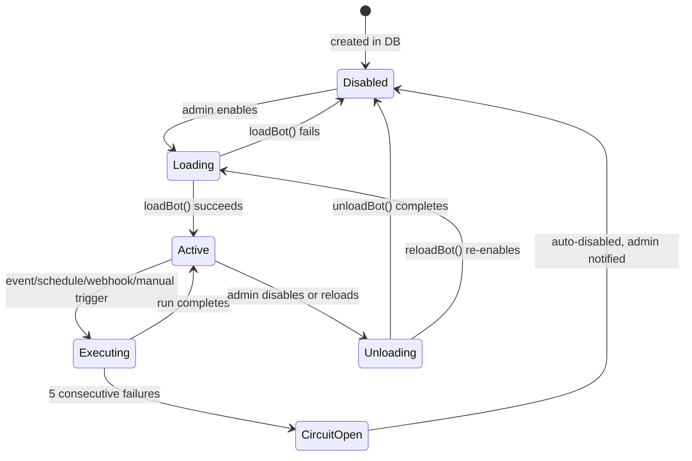
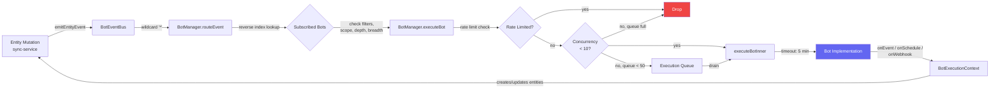

# Bot System Architecture

## Overview

The bot system is an in-process automation framework that runs inside the ThreatCaddy team server. It lets administrators create bots that react to entity changes, run on schedules, accept inbound webhooks, or are triggered manually. Bots can enrich IOCs, post summaries, run integration workflows, or execute LLM-powered agent loops -- all without external infrastructure.

Everything runs in the Hono server process. A singleton `BotManager` handles lifecycle, event routing, concurrency, rate limiting, and circuit-breaking. Each bot operates under a dedicated user account with scoped capabilities, so its mutations flow through the same sync, audit, and permission paths as human users.

## Bot Types

| Type | Purpose |
|------|---------|
| `enrichment` | Reacts to newly created IOCs and queries external enrichment APIs. Creates notes with the results. |
| `feed` | Posts content to CaddyShack (the activity feed). Generic type handled by `GenericBot`. |
| `monitor` | Runs on a schedule, lists investigations in scope, counts IOCs and tasks, and posts periodic summaries. |
| `triage` | Intended for automated triage workflows. Generic type handled by `GenericBot`. |
| `report` | Intended for report generation. Generic type handled by `GenericBot`. |
| `correlation` | Intended for cross-investigation correlation. Generic type handled by `GenericBot`. |
| `ai-agent` | LLM-powered agent that runs a tool-calling loop (Anthropic, OpenAI, Gemini, Mistral). |
| `integration` | Executes integration templates (multi-step workflows with HTTP calls, entity creation, notifications). |
| `custom` | Catch-all for user-defined logic. Handled by `GenericBot`. |

Types without a dedicated implementation class (`feed`, `triage`, `report`, `correlation`, `custom`) fall through to `GenericBot`, which is a no-op base class. They can still be triggered by events, schedules, or webhooks -- the intended use is for future specialization or for integration templates that embed their own logic.

## Class Hierarchy

```
Bot (interface)
  GenericBot (base class -- wraps BotContext into BotExecutionContext)
    EnrichmentBot
    MonitorBot
    IntegrationBot
    AgentBot
```

The factory function `createBotImplementation(config)` maps `config.type` to the appropriate class. Unknown types get `GenericBot`.

## Lifecycle

### Initialization

1. `BotManager.init()` queries all enabled `botConfigs` rows from the database.
2. Each config is passed to `loadBot()`, which:
   - Stores the config in memory.
   - Builds a reverse index of event types to bot IDs for O(1) event routing.
   - Registers rate limit buckets (hourly and daily).
   - Calls `createBotImplementation()` to instantiate the implementation class.
   - Calls `bot.onInit(config)` for implementation-specific setup.
   - Decrypts secrets in the config (API keys, tokens) and caches them in memory.
   - Sets up a cron job if `config.triggers.schedule` is defined.
3. Stale `bot_runs` with status `running` from a previous crash are cleaned up (marked as `error`).
4. A wildcard listener is registered on `BotEventBus` to route all events.

### Reload

`reloadBot(botId)` unloads the bot (stopping cron jobs, aborting in-flight runs, removing event subscriptions), then re-reads the config from the database and loads it fresh. This is called when an admin updates a bot's configuration.

### Shutdown

`shutdown()` removes the wildcard event listener, aborts all in-flight executions via `AbortController`, calls `onDestroy()` on every bot, stops all cron jobs, and clears all in-memory state.

### State Diagram



## Event System

### Event Types

| Event | Emitted When |
|-------|-------------|
| `entity.created` | A new entity (IOC, note, task, timeline event) is synced |
| `entity.updated` | An existing entity is updated |
| `entity.deleted` | An entity is deleted |
| `investigation.created` | A new investigation folder is created |
| `investigation.closed` | An investigation's status changes to `closed` |
| `investigation.archived` | An investigation's status changes to `archived` |
| `post.created` | A CaddyShack post is created |
| `member.added` | A member is added to an investigation |
| `member.removed` | A member is removed from an investigation |
| `webhook.received` | An inbound webhook is received for a bot |

### How Events Flow

Events originate in the sync service. When `processPush` successfully mutates an entity, it calls `emitEntityEvent()`, which constructs a `BotEvent` and emits it on the singleton `BotEventBus`. The `BotManager` listens on the wildcard channel (`*`) and routes each event to subscribed bots.

### Event Filters

Bots can narrow which events they receive using `triggers.eventFilters`:

- **`tables`** -- Only trigger for entities in these tables (e.g., `standaloneIOCs`, `notes`).
- **`folderIds`** -- Only trigger for events in specific investigations.
- **`iocTypes`** -- Only trigger for specific IOC types (e.g., `ip`, `domain`, `hash`).

Additionally, bots have a **scope** (`global` or `investigation`) that filters events by folder. A bot scoped to specific investigations will not receive events from other investigations.

### Depth and Breadth Limits

Bots can emit events (by creating/updating entities), which could trigger other bots, creating chains. Two safeguards prevent runaway loops:

- **Depth limit (3):** Events carry a `depth` counter incremented each time a bot emits a follow-on event. At depth >= 3, events are dropped.
- **Breadth limit (10):** A single event can trigger at most 10 bots. Additional subscribed bots are skipped.
- **Self-trigger prevention:** A bot cannot trigger itself. The `originBotIds` array tracks all bots in the chain, preventing re-entry.

These limits are enforced using `AsyncLocalStorage` contexts (`botEventDepth`, `botEventOrigins`) that propagate through the async call stack.

## Event Flow Diagram



## Execution Controls

### Concurrency

| Setting | Default | Env Var |
|---------|---------|---------|
| Max concurrent runs | 10 | `BOT_MAX_CONCURRENT_RUNS` |
| Max queue size | 50 | (hardcoded) |

When all 10 slots are occupied, new executions enter a FIFO queue. If the queue reaches 50, additional executions are dropped. Rate limit tokens are consumed when an item is dequeued, not when it enters the queue, to avoid wasting tokens on items that may never run.

### Timeouts

| Setting | Default | Env Var |
|---------|---------|---------|
| Execution timeout | 5 minutes (300,000 ms) | `BOT_EXECUTION_TIMEOUT_MS` |

Each execution gets an `AbortController`. A `setTimeout` fires after the timeout period, calling `abort()`. Bot implementations must check `ctx.signal` and stop when aborted. Timed-out runs are recorded with status `timeout`.

### Rate Limiting

Rate limiting uses a token-bucket algorithm. Each bot gets two buckets:

- **Hourly:** `config.rateLimitPerHour` tokens, refilled over 1 hour.
- **Daily:** `config.rateLimitPerDay` tokens, refilled over 24 hours.

Buckets are registered when a bot loads and removed when it unloads. Idle buckets are evicted after 24 hours by a periodic cleanup timer. Both `canConsume` and `tryConsume` are available for check-then-act patterns.

### Circuit Breaker

An in-memory counter tracks consecutive errors per bot. When a bot hits **5 consecutive failures** (error or timeout):

1. The bot is auto-disabled in the database.
2. It is unloaded from the `BotManager`.
3. A notification is sent to the admin who created the bot.
4. The counter resets on the next successful run.

This avoids querying the database on every error and prevents a broken bot from consuming resources indefinitely.

## Security

### Capabilities Model

Each bot declares an array of capabilities that govern what actions it can perform:

| Capability | Grants |
|-----------|--------|
| `read_entities` | Search, list, read notes/tasks/IOCs/timeline events |
| `create_entities` | Create notes, tasks, IOCs, timeline events |
| `update_entities` | Update existing entities |
| `post_to_feed` | Post to CaddyShack |
| `notify_users` | Send notifications |
| `call_external_apis` | Make outbound HTTP requests (restricted to `allowedDomains`) |
| `cross_investigation` | Search/read across investigations (overrides scope) |
| `execute_remote` | SSH commands, SOAR playbook triggers |
| `run_code` | Execute code in sandboxed Docker containers |

The `BotExecutionContext` enforces these capabilities at the API boundary. A bot without `create_entities` cannot call `createNote()`, regardless of what its code attempts.

### Outbound HTTP Allowlist

Bots with `call_external_apis` are further restricted by `config.allowedDomains`, an array of domain strings. HTTP requests to domains not on the list are rejected by `BotExecutionContext.fetchExternal()`.

### Sandbox (Docker Isolation)

Bots with `run_code` can execute Python, Node.js, or Bash code in ephemeral Docker containers with strict isolation:

| Control | Setting |
|---------|---------|
| Network | Disabled (`NetworkMode: 'none'`) |
| Filesystem | Read-only root, tmpfs `/sandbox` (50 MB), tmpfs `/tmp` (10 MB) |
| User | `nobody` (UID 65534) |
| Capabilities | All dropped (`CapDrop: ['ALL']`) |
| Privilege escalation | Blocked (`no-new-privileges`) |
| Memory | 128 MB hard limit (no swap) |
| CPU | 0.5 cores |
| PIDs | Max 64 (prevents fork bombs) |
| Timeout | 30 s default, 120 s max |
| Output | 1 MB per stream (stdout/stderr), truncated beyond |
| Cleanup | `AutoRemove: true` |

Supported languages and their images:

| Language | Default Image |
|----------|--------------|
| `python` | `python:3.12-slim` |
| `nodejs` | `node:22-alpine` |
| `bash` | `alpine:3.19` |

Images can be overridden via `SANDBOX_PYTHON_IMAGE`, `SANDBOX_NODE_IMAGE`, `SANDBOX_BASH_IMAGE` env vars. A `prePullSandboxImages()` function is available for pre-pulling at server startup.

### Secret Encryption

Bot configuration secrets (API keys, tokens, passwords) are encrypted at rest using AES-256-GCM.

- **Key derivation:** `scrypt(masterKey, 'threatcaddy-bot-secrets-v1', 32)` where `masterKey` comes from `BOT_MASTER_KEY` env var (falls back to `JWT_PRIVATE_KEY`).
- **Format:** `enc:<iv-base64>:<authTag-base64>:<ciphertext-base64>`
- **Field detection:** Keys ending in `secret`, `password`, `token`, `apikey`, `api_key`, `auth_key`, `private_key`, or `encryption_key` are auto-detected as secrets.
- **API redaction:** Secret fields are replaced with `***configured***` or `***not set***` in API responses.
- **Backwards compatibility:** Values not prefixed with `enc:` are returned as-is (for migration from plaintext).

Secrets are decrypted once when a bot loads and cached in `BotManager.decryptedConfigs`. They are never exposed via the API.

## Implementation Guide

### Creating a New Bot Type

1. **Create the implementation class** in `server/src/bots/implementations/`:

```typescript
import type { BotExecutionContext } from '../bot-context.js';
import type { BotEvent } from '../types.js';
import { GenericBot } from './generic-bot.js';

export class MyBot extends GenericBot {
  // React to entity events
  protected override async handleEvent(
    execCtx: BotExecutionContext,
    event: BotEvent,
  ): Promise<void> {
    // Use execCtx methods (gated by capabilities):
    // execCtx.createNote(folderId, title, content, tags)
    // execCtx.createIOC(folderId, type, value, confidence)
    // execCtx.listIOCs(folderId, type, limit)
    // execCtx.fetchExternal(url, opts)
    // execCtx.postToFeed(content, folderId)
    // execCtx.notifyUser(userId, message, folderId)
  }

  // React to cron schedule
  protected override async handleSchedule(
    execCtx: BotExecutionContext,
  ): Promise<void> {
    // ...
  }

  // React to inbound webhooks
  protected override async handleWebhook(
    execCtx: BotExecutionContext,
    payload: Record<string, unknown>,
  ): Promise<void> {
    // ...
  }
}
```

2. **Register it in the factory** (`server/src/bots/implementations/index.ts`):

```typescript
import { MyBot } from './my-bot.js';

export function createBotImplementation(config: BotConfig): Bot {
  switch (config.type) {
    // ...existing cases...
    case 'my-type': return new MyBot(config);
    default: return new GenericBot(config);
  }
}
```

3. **Add the type** to the `BotType` union in `server/src/bots/types.ts`:

```typescript
export type BotType = '...' | 'my-type';
```

### Required Methods

The `Bot` interface requires:

| Method | When Called | Required |
|--------|-----------|----------|
| `onInit(config)` | Bot is loaded | Yes (base class provides default) |
| `onDestroy()` | Bot is unloaded | Yes (base class provides default) |
| `onEvent(ctx, event)` | Event trigger | Optional |
| `onSchedule(ctx)` | Cron trigger | Optional |
| `onWebhook(ctx, payload)` | Webhook trigger | Optional |

The `GenericBot` base class wraps `BotContext` into `BotExecutionContext` (which enforces capabilities) and delegates to `handleEvent`, `handleSchedule`, and `handleWebhook`. Extend `GenericBot` and override only the handlers you need.

### Configuration

Bot configuration is stored in the `botConfigs` database table. The `config` JSON field holds bot-specific settings (e.g., `enrichmentUrl` for enrichment bots, `llmProvider`/`llmModel`/`systemPrompt` for agent bots, `template` for integration bots). Secret fields within this JSON are automatically encrypted/decrypted.

### Key Files

| File | Purpose |
|------|---------|
| `server/src/bots/bot-manager.ts` | Singleton manager: lifecycle, routing, concurrency, circuit breaker |
| `server/src/bots/types.ts` | Type definitions: BotType, BotEvent, BotConfig, BotContext, Bot interface |
| `server/src/bots/event-bus.ts` | In-process event bus, depth/origin tracking via AsyncLocalStorage |
| `server/src/bots/rate-limiter.ts` | Token-bucket rate limiter |
| `server/src/bots/secret-store.ts` | AES-256-GCM encryption for bot secrets |
| `server/src/bots/sandbox.ts` | Docker sandbox for code execution |
| `server/src/bots/bot-context.ts` | Capability-gated execution context |
| `server/src/bots/bot-tools.ts` | Tool definitions for AI agent bots |
| `server/src/bots/implementations/generic-bot.ts` | Base class for all bot implementations |
| `server/src/bots/implementations/index.ts` | Factory function mapping type to class |
