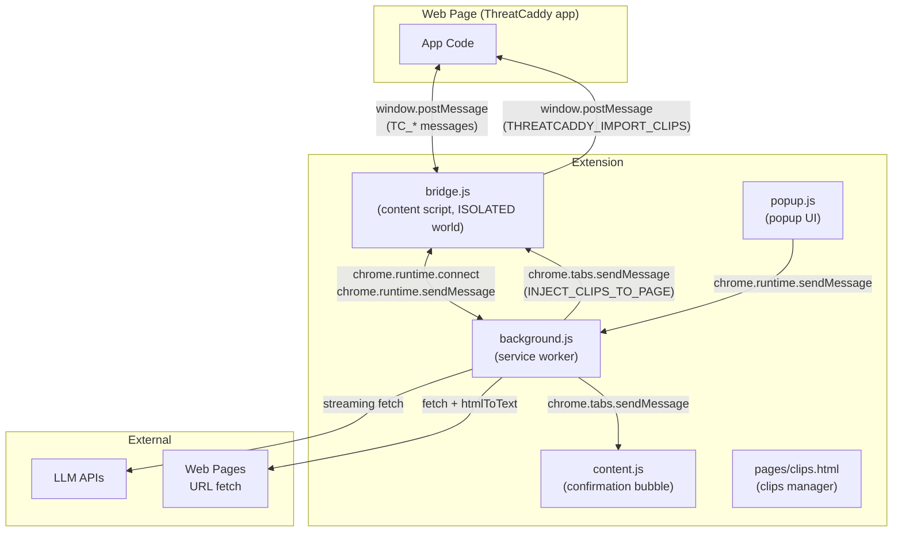

# Extension Bridge Protocol

## Overview

The ThreatCaddy browser extension (Chrome MV3 / Firefox) serves two purposes:

1. **Clip capture** -- Select text on any web page, right-click or press a keyboard shortcut, and save it as a Markdown clip to be imported into ThreatCaddy.
2. **LLM proxy** -- The ThreatCaddy web app routes AI API calls (Anthropic, OpenAI, Gemini, Mistral, local endpoints) through the extension's background service worker to bypass CORS restrictions. This enables streaming LLM responses directly in the browser without a backend relay.

All captured data stays in `chrome.storage.local`. The extension makes no network requests except those explicitly initiated by the user (sending clips to the target app, or proxying LLM API calls with user-provided keys).

### Architecture

## Communication Flow

The web app and the extension communicate through a multi-hop message chain:

### Web App to Extension (LLM Request)

1. The web app posts a `TC_LLM_REQUEST` message to `window` via `postMessage`.
2. `bridge.js` (content script) receives it, opens a long-lived port to the background service worker via `chrome.runtime.connect({ name: 'llm-<requestId>' })`, and forwards the payload.
3. The background worker streams the LLM API response, sending `chunk` messages back through the port.
4. `bridge.js` relays each chunk as a `TC_LLM_CHUNK` postMessage to the web app.
5. When the stream completes, the background sends `done` (or `error`), which `bridge.js` relays as `TC_LLM_DONE` (or `TC_LLM_ERROR`).

### Web App to Extension (URL Fetch)

1. The web app posts a `TC_FETCH_URL` message.
2. `bridge.js` forwards it to the background via `chrome.runtime.sendMessage`.
3. The background fetches the URL, converts the HTML to Markdown, and sends the result back.
4. `bridge.js` relays the result as `TC_FETCH_URL_RESULT`.

### Extension to Web App (Clip Import)

1. The clips page calls `chrome.runtime.sendMessage({ type: 'SEND_TO_TARGET', targetUrl, captures })`.
2. The background opens the target URL in a new tab, waits for it to load, injects `bridge.js`, then sends `INJECT_CLIPS_TO_PAGE` to the content script via `chrome.tabs.sendMessage`.
3. `bridge.js` receives it and posts `THREATCADDY_IMPORT_CLIPS` to the page via `window.postMessage`.
4. The web app receives the clips and imports them.

## Message Types

### Page to Extension (via `window.postMessage`)

| Message Type | Fields | Description |
|-------------|--------|-------------|
| `TC_EXTENSION_PING` | (none) | App checks if extension is present. Extension responds with `TC_EXTENSION_READY`. |
| `TC_LLM_REQUEST` | `requestId`, `payload` | Start an LLM streaming request. `payload` contains `provider`, `model`, `apiKey`, `systemPrompt`, `messages`, `tools`. |
| `TC_LLM_ABORT` | `requestId` | Abort an in-flight LLM request by disconnecting the port. |
| `TC_FETCH_URL` | `requestId`, `url` | Fetch a URL and return its content as Markdown text. |

### Extension to Page (via `window.postMessage`)

| Message Type | Fields | Description |
|-------------|--------|-------------|
| `TC_EXTENSION_READY` | `protocolVersion`, `capabilities` | Signals extension presence. Sent on load, BFCache restore, visibility change, and in response to `TC_EXTENSION_PING`. |
| `TC_LLM_CHUNK` | `requestId`, `content` | A streamed text chunk from the LLM. |
| `TC_LLM_DONE` | `requestId`, `stopReason`, `contentBlocks` | LLM stream completed. `contentBlocks` contains structured blocks (text, tool_use). `stopReason` is normalized to `end_turn`, `tool_use`, or `max_tokens`. |
| `TC_LLM_ERROR` | `requestId`, `error` | LLM request failed. |
| `TC_FETCH_URL_RESULT` | `requestId`, `success`, `title`, `content`, `url`, `error` | URL fetch result. `content` is the page body converted to Markdown. |
| `THREATCADDY_IMPORT_CLIPS` | `clips` | Array of clip objects to import into the web app. Sent when clips are delivered from the clips manager page. |

### Internal Extension Messages (via `chrome.runtime.sendMessage`)

| Message Type | Sender | Handler | Description |
|-------------|--------|---------|-------------|
| `PING` | content.js / background.js | content.js | Checks if content script is injected. Returns `{ loaded: true }`. |
| `FETCH_URL` | bridge.js | background.js | Proxy a URL fetch through the service worker (avoids CORS). |
| `SAVE_NOTE` | popup.js | background.js | Save a manual capture from the popup quick-capture form. |
| `GET_STATS` | popup.js | background.js | Get capture statistics (total, this week, recent 3). |
| `OPEN_CLIPS_PAGE` | popup.js / content.js | background.js | Open the clips manager page in a new tab. |
| `SEND_TO_TARGET` | clips page | background.js | Open the target URL and inject clips into the page. |
| `SHOW_CONFIRMATION` | background.js | content.js | Show a confirmation bubble after a clip capture. |
| `HIDE_BUBBLE` | background.js | content.js | Hide the confirmation bubble. |
| `INJECT_CLIPS_TO_PAGE` | background.js | bridge.js | Deliver clips to the page for import. |

### LLM Port Messages (via `chrome.runtime.connect`)

Port names follow the pattern `llm-<requestId>`.

| Direction | Message | Fields | Description |
|-----------|---------|--------|-------------|
| bridge to background | (payload) | `provider`, `model`, `apiKey`, `systemPrompt`, `messages`, `tools`, `endpoint` | Initial LLM request payload. |
| background to bridge | `chunk` | `content` | Streamed text delta. |
| background to bridge | `done` | `stopReason`, `contentBlocks` | Stream complete. |
| background to bridge | `error` | `error` | Stream failed. |

## Security

### Origin Validation

- `bridge.js` only processes messages where `event.source === window` (same-window origin).
- Internal extension messages are validated with `sender.id !== chrome.runtime.id` checks.
- The `INJECT_CLIPS_TO_PAGE` handler in `bridge.js` verifies that the sender is the extension itself before forwarding clips to the page.

### Protocol Versioning

`bridge.js` declares a `TC_PROTOCOL_VERSION` (currently `1`) and a `TC_CAPABILITIES` array (`['llm_streaming', 'fetch_url', 'clip_import']`). These are sent in every `TC_EXTENSION_READY` message so the web app can detect which features the installed extension supports and degrade gracefully if the version is older.

### Duplicate Injection Guard

`bridge.js` uses `document.documentElement.dataset.tcBridgeLoaded` to prevent double-initialization when both static `content_scripts` and dynamic `executeScript` inject it onto the same page. If already loaded, it re-sends `TC_EXTENSION_READY` and exits.

### Extension Context Validation

Before processing any message, `bridge.js` calls `isExtensionValid()` which checks `chrome.runtime.id`. If the extension context has been invalidated (e.g., extension updated or unloaded), it returns an error to the web app instead of silently failing.

### Host Permission Model

LLM API origins are declared as `optional_host_permissions` rather than granted by default. The background worker calls `ensureLLMPermission(url)` before every LLM API call, throwing an error if the permission hasn't been granted. Users enable these permissions via toggle switches in the popup UI.

Similarly, URL fetching (`FETCH_URL`) checks `chrome.permissions.contains` for the target origin before fetching, and requests permission if not yet granted.

### URL Validation

The `FETCH_URL` handler validates that the URL uses `http:` or `https:` protocol before fetching. The `SEND_TO_TARGET` handler validates `http:`, `https:`, or `file:` protocols.

## Background Worker

The background service worker (`background.js`) handles:

### LLM Streaming Proxy

Accepts long-lived port connections (name prefix `llm-`) and streams responses from LLM providers:

| Provider | Endpoint | Auth |
|----------|----------|------|
| Anthropic | `api.anthropic.com/v1/messages` | `x-api-key` header or `Bearer` token |
| OpenAI | `api.openai.com/v1/chat/completions` | `Bearer` token |
| Gemini | `generativelanguage.googleapis.com/v1beta/models` | URL query param `key` |
| Mistral | `api.mistral.ai/v1/chat/completions` | `Bearer` token |
| Local | User-configured endpoint (default `localhost:11434/v1`) | Optional `Bearer` token |

All providers use SSE streaming. Responses are normalized to a common format: `chunk` messages with text content, followed by a `done` message with `stopReason` (`end_turn`, `tool_use`, or `max_tokens`) and `contentBlocks` (text and tool_use blocks). Tool call arguments are accumulated across deltas and parsed into JSON on completion.

### CORS Proxy (URL Fetch)

Fetches arbitrary URLs with a 15-second timeout, converts the HTML response to Markdown using a regex-based `htmlToText()` function (strips scripts, styles, nav, header, footer; converts headings, links, lists, code blocks), and returns `{ title, content }`. Output is truncated to 50 KB.

### Clip Capture and Storage

- **Context menu:** "Save to ThreatCaddy" on text selections. Injects `getSelectionAsMarkdown()` into the page to capture rich content with inline base64 images.
- **Keyboard shortcut:** `Alt+Shift+X` (Mac: `Ctrl+Shift+X`). Captures selection if present, otherwise captures full page via `getPageAsMarkdown()`.
- **Popup quick capture:** Saves manual text entries.
- **Storage:** Clips are stored in `chrome.storage.local` under the `captures` key, capped at 500 entries (FIFO eviction).

### Dynamic Bridge Registration

Static `content_scripts` in the manifest only cover `threatcaddy.com`. For self-hosted instances, localhost, or custom targets:

- `syncBridgeRegistration()` reads `settings.targetUrl` from storage and registers a dynamic content script for the matching origin using `chrome.scripting.registerContentScripts`.
- For `file://` URLs (which can't use `registerContentScripts`), a `tabs.onUpdated` listener injects `bridge.js` via `executeScript` when a matching page loads.
- Re-syncs on every service worker startup and whenever `settings` changes in storage.

### Clip Delivery to Target

`sendToTarget(targetUrl, captures)`:
1. Opens the target URL in a new tab.
2. Waits for `complete` status (30-second timeout).
3. Waits 2.5 seconds for React to mount.
4. Injects `bridge.js` (safe with duplicate guard).
5. Sends `INJECT_CLIPS_TO_PAGE` to the content script.

## Content Script

`content.js` is a lightweight script that shows confirmation bubbles after clip captures. It is injected on demand (not via `content_scripts` in the manifest) using `chrome.scripting.executeScript` when the background worker needs to show a confirmation.

### Responsibilities

- Respond to `PING` messages (used to check if already injected).
- Show a styled confirmation bubble near the selection or at the top-right of the viewport.
- Auto-hide after 5 seconds, or on click outside, or on scroll.
- Provide a "Review All Captures" button that opens the clips manager page.

## Permissions

### Required Permissions (`permissions`)

| Permission | Purpose |
|-----------|---------|
| `contextMenus` | "Save to ThreatCaddy" right-click menu item |
| `storage` | Store captured clips and extension settings in `chrome.storage.local` |
| `activeTab` | Access the current tab for content script injection and selection capture |
| `scripting` | Inject `bridge.js`, `content.js`, and inline functions (`getSelectionAsMarkdown`, `getPageAsMarkdown`) into pages |
| `tabs` | Query tab state, listen for tab updates (for dynamic bridge injection and clip delivery) |

### Required Host Permissions (`host_permissions`)

| Pattern | Purpose |
|---------|---------|
| `http://localhost/*` | Bridge injection and clip delivery for local development instances |
| `http://127.0.0.1/*` | Bridge injection and clip delivery for local development instances |

### Optional Host Permissions (`optional_host_permissions`)

These are requested at runtime via toggle switches in the popup UI:

| Pattern | Purpose |
|---------|---------|
| `https://api.anthropic.com/*` | CaddyAI: Anthropic API streaming |
| `https://api.openai.com/*` | CaddyAI: OpenAI API streaming |
| `https://generativelanguage.googleapis.com/*` | CaddyAI: Gemini API streaming |
| `https://api.mistral.ai/*` | CaddyAI: Mistral API streaming |
| `*://*/*` | URL fetching for the `/fetch` command (broad host access) |
| `file:///*` | Access local HTML files for standalone/offline ThreatCaddy instances |

The extension defaults to minimal permissions. Users explicitly grant AI and URL-fetch permissions when they need those features.
